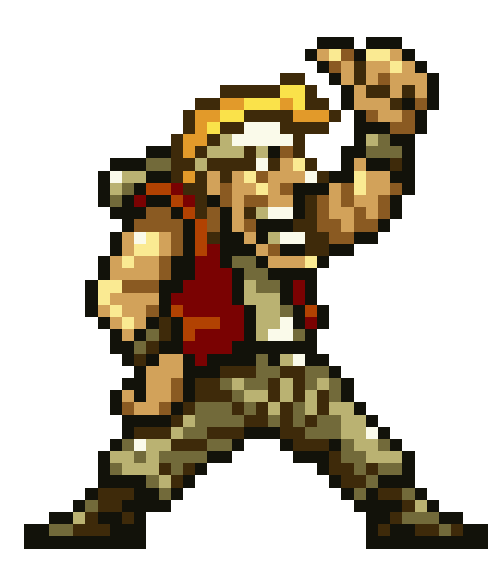
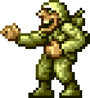

# Metal Slug


## Descripción General (Boceto)

<p align="justify">
El juego será un shooter de acción basado en el mítico juego Metal Slug, en el que el jugador controla a un soldado que avanza lateralmente a través de niveles llenos de enemigos, obstáculos y jefes finales.
El jugador puede disparar armas, meterse a un vehiculo, vidas, y esquivar ataques enemigos. Además, se rescatarán las mejores partes del juego original,
asi mostrando las escenas y momentos más icónicos que contribuyeron a su gran popularidad. El objetivo es completar ciertos niveles sin perder todas las vidas y 
obtener la mayor puntuación posible. El juego contará con animaciones para los personajes, explosiones y efectos de colisiones, usando CSS, JavaScript y HTML5. 
Asimismo, incluirá textos precargados que aparecerán junto al personaje en determinados momentos, mostrando frases que añaden contexto o referencias al estilo del juego original, enriqueciendo la experiencia de acción y narrativa.

## Distribución Pantalla 1 (Boceto)


## Distribucción Pantalla 2 (Boceto)

**NOTA:** Todos los colores pueden variar en el producto final, esto se podran modificar segun el proceso de la construcción del juego.

# Producto Final

## Distribución Pantalla 1


## Distribución Pantalla 2


## Cuerpo del index.html
```html
<!DOCTYPE html>
<html lang="en">

<head>
  <meta charset="UTF-8">
  <meta name="viewport" content="width=device-width, initial-scale=1.0">
  <title>Metal-Slug</title>
  <link rel="stylesheet" href="css/estilo.css">
</head>

<body>
  <div class="encabezado">
    <div class="Puntuacion">
      <h1>SCORE:</h1>
      <h1 id="Puntuacion"> </h1>
    </div>

    <div class="Vidas">
      <h1>VIDAS:</h1>
      <canvas id="Vidas"> </canvas>
    </div>
  </div>

  <div class="area" role="application" aria-label="Metal-Slug canvas">
    <canvas id="lienzo" width="800" height="800"></canvas>
  </div>

  <script src="js/metal.js"></script>
</body>

</html>
```
## Cuerpo del menu.html
```html
<!DOCTYPE html>
<html lang="en">
<head>
  <meta charset="UTF-8">
  <meta name="viewport" content="width=device-width, initial-scale=1.0">
  <title>Metal-Slug</title>
  <style>
    body {
        height: 100vh;
        margin: 0;
        display: flex;
        flex-direction: column;
        align-items: center;
        background: black;
        padding-top: 50px;
    }

    .frame1 {
        display: flex;
        flex-direction: row;
        justify-content: space-between;
        align-items: center;
        padding-top: 60px;
    }

    .boton{
        display: flex;
        flex-direction: column;
        justify-content: center;
        margin: 02px;
    }

    .encabezado{
        display:flex;
        flex-direction: column;
        align-content: stretch;
        margin: 50px;
    }

    .titulo{
        color: #ee8515; 
        text-shadow:
            0 0 10px #e0831f, 
            0 0 20px #ee8515, 
            0 0 30px #ee8515,
            0 0 40px #ee8515; 
        font-size: 80px;
        font-family: 'Arial', sans-serif;
        margin: 0;
    }

    .Subtitulo{
        color:grey;
        font-size: 20px;
        margin: 0px;
    }
 
    button:hover{
        background-color:#ee8515;
        box-shadow: 
            0 0 10px #e0831f,
            0 0 20px #ee8515, 
            0 0 30px #ee8515, 
            0 0 35px #d57a19; 
    }

    button{
        margin: 20px;
        width: 300px;
        height: 50px;
        border-radius: 50px;
        font-size: 25px;
        background-color: grey;         
        color: white;
        border: none;  
        box-shadow: 
            0 0 10px #555,
            0 0 20px #666;
    }
    .boton{
        margin-left: 50px;
        margin-right: 50px;
    }
    </style>
</head>
<body>
    <div class="encabezado">
        <h1 class="titulo">METAL SLUG</h1>
        <h6 class="Subtitulo">Arcade</h6>
    </div>
    
    <div class="frame1">
        <div class="MarcoRossi">
            
        </div>

        <div class="boton">
            <button id="Continuar" onclick="window.location.href='index.html'">Jugar</button>
            <button id="Record"  onclick="mostrarRanking()">Mejores Record</button>
        </div>

        <div class="Soldado">
            
        </div>
    </div>
    
     <script src="js/metal.js"></script>
 
</body>
</html>
```
## Estilos para la página index.html
Perimite que se le de una buen diseño a al parte del juego (canva) ,asi como el score y vida.
```html
:root {
  --bg-init: #043326;
  --bg-end: #094433;
}

body {
  height: 100vh;
  margin: 0;
  display: flex;
  flex-direction: column;
  align-items: center;
  justify-content: center;
  background: linear-gradient(135deg, var(--bg-init) 0%, var(--bg-end)  100%);
}

.area {
  width: 1700px;   
  height: 600px;   
  box-shadow: 0 8px 30px rgba(2, 6, 23, 0.7);
  border-radius: 12px;
  box-sizing: border-box;
  background: radial-gradient(circle at 30% 50%, rgba(255,255,255,0.05), transparent 20%),
              linear-gradient(90deg, rgba(255,255,255,0.05), transparent 60%);
  overflow: hidden;
  position: relative;
  margin: 20px auto;
}

.area canvas {
  width: 100%;
  height: 100%;
  display: block;
  /*image-rendering: pixelated;*/
}

.encabezado{
  width: 1700px;
  margin: 0 auto; /* centra el encabezado en la página */
  padding: 0 20px;
  display: flex;
  flex-direction: row;
  align-items: center;
  justify-content: space-between;;
}

.encabezado h1 {
  color: White;
  margin: 15px; 
  font-size: 2rem;
}

.encabezado div  {
  width: 400px;
  height: 60px; 

  display: flex;
  flex-direction: row;
  align-items: center;
  justify-content:flex-start;

  box-shadow: 0 8px 30px rgba(2, 6, 23, 0.7);
  border-radius: 12px;
  box-sizing: border-box;
  background:linear-gradient(45deg,#da9d00,#b18e50) ;

  margin: 20px;
}

.Vidas canvas {
  display: flex;
  align-items: center;
}

```
## Carga de imagenes(sprint a usar)
```JavaScript
//Carga la imagen de fondo
const fondo=new Image();
fondo.src="src/MetalSlug-Mission1.png";

//Carga la imagen de Marco correiendo
const Run=new Image()
Run.src="src/MarcoCorriendo.png";

//Carga la imagen de Marco Quieto
const Seat=new Image()
Seat.src="src/MarcoQuieto.png";

//Carga la imagen de Marco Dispando
const Crouched=new Image()
Crouched.src="src/MarcoAgachado.png";

//Carga la imagen de Marco Dispando
const Shoot=new Image()
Shoot.src="src/MarcoDisparando.png";

//Carga el imagen de Caja
const Box=new Image()
Box.src="src/Caja.png";

//Carga la imagen de viejito
const Viejo=new Image()
Viejo.src="src/Ayuda.png";

//Carga la imagen de salida del viejito
const Salida=new Image()
Salida.src="src/Salida.png";

//Carga a Soldado 1
const Soldado=new Image()
Soldado.src="src/Soldado.png";

//Carga a MarcoAtras
const Atras=new Image()
Atras.src="src/MarcoAtras.png";
```
## Carga de musica de fondo
Se crea un nuevo objeto de audio en JavaScript, donde se carga la música de fondo, la cual se establece con un 30% de volumen como máximo, y se configura la propiedad loop del objeto MusicaFondo en true, lo que hara que el archivo de audio se reproduzca en bucle.
```JavaScript
//Definicion de musica de Fondo
const MusicaFondo=new Audio('src/Audio/Soundtrack.mp3');
MusicaFondo.loop=true;
MusicaFondo.volume=0.3;
```

## Referencias
Se hace referencia a los canvas, así como el label que se definieron en nuestro html.
```JavaScript
//Referencia canvas del escenario principal
const canvas=document.getElementById("lienzo");                 
const ctx=canvas.getContext("2d");

//Referencia del canvas para la vida
const canvasV=document.getElementById("Vidas");                 
const ctv=canvasV.getContext("2d");

//Pal Score
const label_score=document.getElementById("Puntuacion");
```
## Posicionamiento de los Srpites
Esta parte define las posiciones de los cuadros (frames) de animación para varios personajes en una hoja de sprites. Cada arreglo guarda las coordenadas (x, y) de las imágenes que forman la animación de Marco Rossi (con y sin disparo), del viejo (apareciendo y saliendo) y del soldado. Los bucles calculan esas posiciones multiplicando el número de frame por el ancho de cada imagen.
```JavaScript
//Posicion de las acciones de MarcoRossi
let posiciones=[];
const anchox=80;
const altoy=250;

// Posiciones para disparo 
let posicionesShoot=[];
const anchoxShoot=130;  
const altoyShoot=250;

//Posiciones del viejo
let posicionesViejo=[];
const anchoxViejo=123;
const altoyViejo=250;

//Posiciones de la salida del viejo
let posicionesSalida=[];
const anchoxSalida=159;
const altoySalida=250;

//Posiciones del soladado
let posicionesSoldado=[];
const anchoxSoldado=268;
const altoySoldado=250;

let indice=0;

//Para imagenes donde MarcoRossi NO dispare
for (let fila=0; fila <6; fila++) {
    posiciones.push([fila*anchox, 0]);
}

//Para imagnes donde MarcoRossi SI dispara
for (let fila=0; fila <6; fila++) {
    posicionesShoot.push([fila*anchoxShoot, 0]);
}

//Para imagenes del viejo
for (let fila=0; fila <9; fila++) {
    posicionesViejo.push([fila*anchoxViejo, 0]);
}

//Para imagenes del viejo
for (let fila=0; fila <8; fila++) {
    posicionesSalida.push([fila*anchoxSalida, 0]);
}

//Para imagenes del Soldado
for (let fila=0; fila <4; fila++) {
    posicionesSoldado.push([fila*anchoxSoldado, 0]);
}
```
# Lógica del juego en JavaScript
Primeramente se configuran la posición, velocidad, escala y estado del personaje Marco Rossi, además del movimiento del fondo (scroll), las vidas y la puntuación. También se definen variables para manejar las animaciones (como disparar o agacharse), la dirección del movimiento y la duración de ciertas acciones.
```JavaScript
let scrollX=0;
const velocidad=5;

//Personaje
let MarcoX=50;
let MarcoY=356;
let VIDAS=3;
const escalaPersonaje=2;
let SCORE=0;
let VelocidadPersonaje=5;
const posicionCamaraMarco=canvas.width*0.35;

const escalaViejo=1.5;
let animacionActiva=false;
let tiempoFrame=0;
const velocidadAnimacion=5;

let teclasPresionadas={};
let ultimaDir="reposo";  // "derecha", "izquierda", "reposo"
let agachado=false;
let disparando=false;
let tiempoDisparo=0;
const duracionDisparo=15;
```
Después se ajusta el tamaño del canvas para que siempre coincida con el tamaño del contenedor .area, incluso si la ventana se redimensiona.
Luego, cuando la imagen del fondo termina de cargarse, se inicia la animación del juego llamando a la función actualizar() mediante requestAnimationFrame(), que permite actualizar los fotogramas de forma continua y fluida.
```JavaScript
// Ajustar canvas al tamaño real del contenedor
function ajustarCanvas() {
  const area=document.querySelector(".area");
  canvas.width=area.clientWidth;
  canvas.height=area.clientHeight;
}
window.addEventListener("resize", ajustarCanvas);
ajustarCanvas();
//Cuando la imagen este lista
fondo.onload=() => {
  requestAnimationFrame(actualizar);
};
```
#Funciones estrechamente relacionadas con nuesto personaje Marco Rosssi
## Función actualizar
Sencillamente en esta función controla todo lo que ocurre en cada fotograma del juego (con uso de banderas): reproduce la música, limpia la pantalla, mueve el fondo y al personaje, cambia la animación según las teclas presionadas (caminar, disparar o agacharse), dibuja al personaje en la posición correcta y actualiza los enemigos, balas, colisiones, vidas y puntaje y finalmente, usa requestAnimationFrame(actualizar) para repetir el proceso y mantener la animación en movimiento continuo.
```JavaScript
function actualizar() {
    MusicaFondo.play();
    ctx.clearRect(0, 0, canvas.width, canvas.height);
    ctv.clearRect(0, 0, canvas.width, canvas.height);

    // Calcular escala para que el fondo llene el alto del canvas
    const escala=canvas.height/fondo.height;
    const anchoEscalado=fondo.width * escala;

    // Dibujar fondo desplazado (centrado verticalmente)
    const parteY=(canvas.height-fondo.height*escala) / 2;
    ctx.drawImage(fondo, -scrollX * escala, parteY, anchoEscalado, fondo.height * escala);

    // Seleccionar qué imagen usar según el estado
    if (!disparando && !agachado) {
        if (teclasPresionadas["ArrowRight"] || teclasPresionadas["d"]) {
            animacionActiva=true;
            ultimaDir="derecha";
            const maxScroll=fondo.width-canvas.width / escala;
            if (MarcoX<posicionCamaraMarco) {
                MarcoX+=VelocidadPersonaje;
            } else if (scrollX < maxScroll) {
            
                scrollX+=velocidad;
                if (scrollX > maxScroll)scrollX=maxScroll;
            } else {
                MarcoX+=VelocidadPersonaje;
            }

        } else if (teclasPresionadas["ArrowLeft"] || teclasPresionadas["a"]) {
            animacionActiva=true;
            ultimaDir="izquierda";

            if (MarcoX > 0 && (MarcoX > posicionCamaraMarco || scrollX <= 0)) {
                MarcoX-=VelocidadPersonaje;
                if (MarcoX < 0) MarcoX = 0;
            }else if (scrollX > 0) {
                scrollX -= velocidad;
                if (scrollX < 0) scrollX = 0; // límite del mapa
            } else {
                animacionActiva=false;
            }
        }
    } else {
        animacionActiva=false;
    }
   // Seleccionar qué imagen y posiciones usar según el estado
    let imagenActual;
    let posicionesActuales;
    let anchoActual;
    let altoActual;

    if (disparando) {
        imagenActual=Shoot;
        posicionesActuales=posicionesShoot;
        anchoActual=anchoxShoot;
        altoActual=altoyShoot;
        tiempoDisparo++;
        if (tiempoDisparo >= velocidadAnimacion) {
            tiempoDisparo=0;
            indice++;
            if (indice >= posicionesActuales.length) {
                disparando=false;
                indice=0;
            }
        }
    } else if (agachado) {
        imagenActual=Crouched;  // Cambia a imagen agachado si presionas
        posicionesActuales=posiciones;
        anchoActual=anchox;
        altoActual=altoy;
    } else {
        imagenActual=animacionActiva ? Run : Seat;
        posicionesActuales=posiciones;
        anchoActual=anchox;
        altoActual=altoy;
        if (animacionActiva && (ultimaDir=="derecha")) {
            tiempoFrame++;
            if (tiempoFrame >= velocidadAnimacion) {
                tiempoFrame=0;
                indice++;
                if (indice >= posicionesActuales.length) {
                    indice=0;
                }
            }
        } else if (animacionActiva && (ultimaDir=="izquierda")) {
            imagenActual=Atras;
            tiempoFrame++;
            if (tiempoFrame >= velocidadAnimacion) {
                tiempoFrame=0;
                indice++;
                if (indice >= posicionesActuales.length) {
                    indice=0;
                }
            }
        }else {
            indice=0;
        }
    }
    //Dibujar Personaje
    ctx.drawImage(imagenActual, posicionesActuales[indice][0], posicionesActuales[indice][1], anchoActual, altoActual,
        MarcoX, MarcoY, anchoActual * escalaPersonaje, altoActual * escalaPersonaje);

    dibujarObjetos(ctx, escala);
    detectarColisiones(escala);
    crearSoldado(escala);
    actualizarSoldados(escala);
    actualizarBalasEnemigos(escala); 
    detectarColisionesBala(escala);
    actualizarBalas(escala); 
    label_score.textContent=SCORE;
    console.log(MarcoX, MarcoY)         
    dibujarCorazonesCentrados(ctv, 3.5, VIDAS, 4);
    requestAnimationFrame(actualizar);
}
```
El siguiente frgamento controla directamente cuándo el jugador presiona o suelta teclas para controlar al personaje. Si se presiona la flecha abajo o la tecla “S”, el personaje se agacha; si se presiona la barra espaciadora, dispara y se crea una bala en su posición. Cuando se sueltan las teclas, el personaje vuelve a su estado normal.
```JavaScript
document.addEventListener("keydown", (e) => {
    teclasPresionadas[e.key]=true;      //Se guarda en diccioanrio Key, valor
    if (e.key == "ArrowDown" ||e.key == 's') {
        agachado=true;
        animacionActiva=false;
        disparando=false;
        indice=0;
    }
    if (e.code == "Space") {         
        disparando=true;
        animacionActiva=false;
        agachado=false;
        indice=0;
        tiempoDisparo=0;
        const posicionBalaxX=MarcoX+(anchox*escalaPersonaje) / 2;
        const posicionBalayY=MarcoY+(altoy*escalaPersonaje) / 4; 
        crearBala(posicionBalaxX, posicionBalayY);
    }
});
document.addEventListener("keyup", (e) => {
    teclasPresionadas[e.key] = false;
    if (e.key == "ArrowDown" || e.key == 's' ) {
        agachado=false;
        indice=0;
        disparando=false;
    }
});
```
Se agregan los objetos viejito, caja y puerta con sus respectivas propiedades (posición, tamaño, estado y animación), asi definiendo los objeto que se van a encontrar durante el escenario.
```JavaScript
const velocidadAnimacionSalida=30;
const objetos=[
    { x: 6190, y: 140, tipo: "viejito", ancho: 50, alto: 50, activo: true, animacionSalida: false, indiceSalida: 0, colisionado: false },
    { x: 4100, y: 180, tipo: "caja", ancho: 70, alto: 70, activo: true, colisionado: false},
    { x: 9200, y: 180, tipo: "puerta", ancho: 70, alto: 70, activo: true, colisionado: false },
];
```
Después se declaran algunas variables que nos va ayudar  a controlar las animaciones del viejito, desde cuando esta amarrado, hasta cuando lo logramos liberar.
```JavaScript
let indiceViejito=0;
let tiempoFrameViejito=0;
const velocidadAnimacionViejito=11;
let tiempoFrameSalida=0;
```
Al tener lo anterirormente declarado se elabora una función la cual itera sobre nuestro vector llamado objetos, que es el encargado de guardar los objetos a salir, con sus respectivas posiciones y algunos tributos.
Esta función se encarga de dibujar en pantalla todos los objetos activos del escenario, teniendo en cuenta el desplazamiento horizontal y la escala aplicada.

Para cada objeto, calcula su posición en pantalla usando la escala y el scroll, y luego dibuja la imagen correspondiente según su tipo (caja, viejito, puerta, etc.).

En el caso del viejito, la función también gestiona su animación:

 - Si está realizando su animación de salida, se mueve hacia la derecha y se aplica un escalado mayor, desactivándose cuando termina la animación o sale de la pantalla.

 - Si está en su animación normal, cicla entre sus fotogramas a una velocidad controlada.
El resto como lo es la caja, es una imagen estatica, sin animación

```JavaScript
function dibujarObjetos(ctx, escala) {
    const parteY=(ctx.canvas.height-fondo.height*escala) / 2;
    objetos.forEach((obj) => {
        if (!obj.activo) return;
        const xPantalla=obj.x-scrollX * escala;
        const yPantalla=parteY+obj.y * escala;
        if (xPantalla+obj.ancho *escala > 0 && xPantalla < ctx.canvas.width) {
            switch (obj.tipo) {
                case "caja":
                    ctx.drawImage(Box, xPantalla, yPantalla, obj.ancho, obj.alto);
                    break;
                case "viejito":
                    if (obj.animacionSalida) {
                        tiempoFrameSalida++;
                        obj.x+=6;
                        const escalaSalida=1.3; 

                        if (tiempoFrameSalida >= velocidadAnimacionSalida) {
                            tiempoFrameSalida=0;
                            obj.indiceSalida++;
                            if (obj.indiceSalida >= posicionesSalida.length || obj.x-scrollX * escala > canvas.width) {
                                obj.activo=false; // se va de pantalla
                            }
                        }
                        if (obj.indiceSalida < posicionesSalida.length) {
                            ctx.drawImage(Salida,posicionesSalida[obj.indiceSalida][0],posicionesSalida[obj.indiceSalida][1],
                                anchoxSalida,altoySalida,xPantalla,yPantalla,
                                anchoxSalida * escalaSalida,altoySalida * escalaSalida);
                        }
                    } else {
                        tiempoFrameViejito++;
                        if (tiempoFrameViejito >= velocidadAnimacionViejito) {
                            tiempoFrameViejito=0;
                            indiceViejito++;

                            if (indiceViejito>=posicionesViejo.length) {
                                indiceViejito = 0;
                            }
                        }
                        ctx.drawImage(Viejo, posicionesViejo[indiceViejito][0],posicionesViejo[indiceViejito][1],
                            anchoxViejo,altoyViejo,xPantalla,yPantalla,
                            anchoxViejo * escalaViejo,altoyViejo * escalaViejo );
                    }
                    break;
            }
        }
    });
}
```
Al estar en una colision,  la funcion anterior llama a una funcion que en si sabe que debe de hacer asi, es decir ejecuta acciones según el tipo de objeto (caja, viejito, puerta), incluyendo aumento de puntuación, animación de salida y síntesis de voz.
```JavaScript
function manejarColision(obj) {
    if (obj.colisionado) return;
    obj.colisionado=true;
    switch (obj.tipo) {
        case "caja":
            SCORE+=100;
            obj.activo=false;
            break;
        case "viejito":
            SCORE += 200;  
            const texto = "Thank you!"
            if (texto.trim() !== '') {
                const utterance=new SpeechSynthesisUtterance(texto); // Creamos una instancia de SpeechSynthesisUtterance
                utterance.lang='en-US'; 
                speechSynthesis.speak(utterance); // Iniciamos la lectura del texto
            }
            // Inicia la animación de salida
            obj.animacionSalida=true;
            obj.indiceSalida=0;
            tiempoFrameSalida=0;
            break;
        case "puerta":
            guardarPuntaje(SCORE);
            break;
    }
}
```
# Funciones para la creación de los soldados
Como primera instancio se empezo por delcar algunas variables que define la configuración y manejo de enemigos en un juego, controlando tanto su aparición como sus acciones.
El objeto configDificultad centraliza parámetros clave para el comportamiento de los enemigos:
- tiempoSpawnMinimo (3000 ms): Tiempo mínimo que debe pasar antes de que un nuevo enemigo aparezca.
- tiempoSpawnMaximo (6000 ms): Tiempo máximo que puede transcurrir entre la aparición de enemigos, generando variabilidad.
- velocidadSoldado (2): Velocidad de movimiento de los enemigos (soldados) en el escenario.
- velocidadBalaSoldado (15): Velocidad a la que se desplazan las balas disparadas por los soldados.
- tiempoDisparo (2000 ms): Intervalo de tiempo entre disparos consecutivos de cada enemigo.

En conjunto, estos parámetros permiten ajustar la dificultad del juego de manera flexible, afectando tanto la frecuencia de aparición de enemigos, como para disparar.
```JavaScript
const configDificultad = {
    tiempoSpawnMinimo: 3000,      // Milisegundos mínimo entre spawns
    tiempoSpawnMaximo: 6000,      // Milisegundos máximo entre spawns
    velocidadSoldado: 2,          // Velocidad de movimiento del soldado
    velocidadBalaSoldado: 15,     // Velocidad de las balas del soldado
    tiempoDisparo: 2000,          // Cada cuánto dispara (milisegundos)
};
```
Despues se declarana algunos rreglos donde se guardaran a los enemigos, las balas, entreo otras variables que definen tamaño del personaje, asi como el de la bala.
```JavaScript
const enemigos=[];
const balasEnemigos=[];
const escalaSolado=1.1;
const enemigobala=15;
```
La aparición de los enemigos se da por:
- ultimoSpawn: Guarda el tiempo en que apareció el último enemigo.
-proximoTiempoSpawn: Se calcula aleatoriamente entre tiempoSpawnMinimo y tiempoSpawnMaximo, determinando cuándo debe aparecer el siguiente enemigo.
```JavaScript
let ultimoSpawn=0;
let proximoTiempoSpawn=Math.random() * (configDificultad.tiempoSpawnMaximo - configDificultad.tiempoSpawnMinimo) + configDificultad.tiempoSpawnMinimo;
```
Asimismo se declaran algunas variables para la animacion de los soldados, las cuales son:
```JavaScript
// Índices para animación del soldado
let indiceSoldado=0;
let tiempoFrameSoldado=0;
const velocidadAnimacionSoldado=8;
```

Para poder dibujar los soldados se ocupa la siguiente funcio la cuál, primero calcula el tiempo actual, y esto permite generar un nuevo enemigo si ha pasado el intervalo de spawn definido aleatoriamente entre tiempoSpawnMinimo y tiempoSpawnMaximo.
Esto evita que los enemigos aparezcan demasiado rápido y mantiene la dificultad equilibrada, además se pone en una posocion random, esto si pegado al borde,, además se a{ade al vector anteriormente declarado, con todos y sus atributos.
```JavaScript
function crearSoldado(escala) {
    const ahora=Date.now();
    if (ahora -ultimoSpawn < proximoTiempoSpawn) return;
    // Posición X cerca del borde derecho de la pantalla
    const xMundo=scrollX + canvas.width + Math.random() * 200;

    // Posición Y igual que Marco, ajustada para que se vea correctamente
    const yMundo=MarcoY/ escala; 
    
    enemigos.push({xMundo: xMundo,yMundo: yMundo,ancho: anchoxSoldado,alto: altoySoldado,
        velocidad: configDificultad.velocidadSoldado,
        activo: true,
        colisionado: false,
        ultimoDisparo: ahora,
        vida: 2,
        indiceAnimacion: 0,
        tiempoFrame: 0
    });
    ultimoSpawn=ahora;
    proximoTiempoSpawn=Math.random() * (configDificultad.tiempoSpawnMaximo - configDificultad.tiempoSpawnMinimo) + configDificultad.tiempoSpawnMinimo;
}
```
Para ir moviendo los soldados se hizo una función la cual lo va moviendo hacia la izquierda con la velocidad establecida anterirormente, con su debida animación ya que estos soldados estan echos con sprite,
además crea la bala de los soldados aleatoriamente.
```JavaScript
function actualizarSoldados(escala) {
    const parteY=(canvas.height-fondo.height * escala) / 2;
    for (let i=enemigos.length-1; i >= 0; i--) {
        const soldado=enemigos[i];

        if (!soldado.activo) {
            enemigos.splice(i, 1);
            continue;
        }
        soldado.xMundo-=soldado.velocidad;

        if (soldado.xMundo < scrollX - 100) {
            soldado.activo=false;
            continue;
        }
        // Disparar cada cierto tiempo
        const ahora=Date.now();
        if (ahora-soldado.ultimoDisparo > configDificultad.tiempoDisparo) {
            crearBalaSoldado(soldado.xMundo, soldado.yMundo);
            soldado.ultimoDisparo=ahora;
        }
        soldado.tiempoFrame++;
        if (soldado.tiempoFrame >= velocidadAnimacionSoldado) {
            soldado.tiempoFrame=0;
            soldado.indiceAnimacion++;
            if (soldado.indiceAnimacion >= posicionesSoldado.length) {
                soldado.indiceAnimacion=0;
            }
        }
        // DIBUJAR SOLDADO
        const xPantalla=(soldado.xMundo-scrollX)*escala; 
        const yPantalla=parteY + soldado.yMundo*escala;
        if (xPantalla + soldado.ancho * escala > 0 && xPantalla < canvas.width) {
            ctx.drawImage(Soldado,posicionesSoldado[soldado.indiceAnimacion][0],posicionesSoldado[soldado.indiceAnimacion][1],
                anchoxSoldado,altoySoldado,xPantalla,
                yPantalla,anchoxSoldado * escalaSolado,altoySoldado * escalaSolado);
        }
    }
}
```
La siguiente función, en si genera una nueva bala disparada por un soldado enemigo y la agrega a la lista de balas activas en el juego, la pone activa con una velodidad definida en el diccionario de configDificultad, anteriormente declarado.
```JavaScript
function crearBalaSoldado(x, y) {
    balasEnemigos.push({xMundo: x,yMundo: y + 80, 
        velocidad: -configDificultad.velocidadBalaSoldado,activa: true});
}
```
Como todo, para qu ela sbalas se vean miviendo se crea una funcion actualizar bala la cual actualiza la posición de todas las balas enemigas activas, dibuja cada bala en pantalla y elimina las balas que ya no están activas o que salen del área visible.
```JavaScript
function actualizarBalasEnemigos(escala) {
    for (let i=balasEnemigos.length-1; i>=0; i--) {
        const bala=balasEnemigos[i];
        if (!bala.activa) {
            balasEnemigos.splice(i, 1);
            continue;
        }
        bala.xMundo+=bala.velocidad;

        if (bala.xMundo < scrollX-50 || bala.xMundo >scrollX+canvas.width+50) {
            bala.activa=false;
            continue;
        }
        const xPantalla=(bala.xMundo-scrollX) * escala;
        ctx.fillStyle='red';
        ctx.beginPath();
        ctx.arc(xPantalla, 450, enemigobala, 0, Math.PI * 2);
        ctx.fill();
    }
}
```

# Logica para elaboración de los corazones.
## Matriz del corazon
```JavaScript
/**
0 = Transparente
1 = Negro
2 = Rojo
3 = Rojo Fuerte
4 = Blanco
**/
const MCORAZON=[
    [0,0,1,1,1,1,0,0,0,1,1,1,1,0,0],
    [0,1,2,2,2,2,1,0,1,2,2,3,3,1,0],
    [1,2,2,4,4,2,2,1,2,2,2,2,3,3,1],
    [1,2,4,4,2,2,2,2,2,2,2,2,2,3,1],
    [1,2,4,2,2,2,2,2,2,2,2,2,2,3,1],
    [1,2,2,2,2,2,2,2,2,2,2,2,2,3,1],
    [1,2,2,2,2,2,2,2,2,2,2,2,3,3,1],
    [0,1,2,2,2,2,2,2,2,2,2,3,3,1,0],
    [0,0,1,2,2,2,2,2,2,2,3,3,1,0,0],
    [0,0,0,1,2,2,2,2,2,3,3,1,0,0,0],
    [0,0,0,0,1,2,2,2,3,3,1,0,0,0,0],
    [0,0,0,0,0,1,3,3,3,1,0,0,0,0,0],
    [0,0,0,0,0,0,1,3,1,0,0,0,0,0,0],
    [0,0,0,0,0,0,0,1,0,0,0,0,0,0,0],
]
```
Definicion de los colores segun el numero en la MCORAZON:
```JavaScript
const COLORES = {
  0: 'rgba(0,0,0,0)',     // Transparente
  1: '#000000',            // Negro
  2: '#f02d2dff',            // Rojo
  3: '#b10000ff',            // Rojo fuerte
  4: '#ffffff'             // Blanco
}
```

Para dibujar un cuadrado en el canvas, se puede crear una función que utilice el contexto del canvas para dibujar un cuadrado  en la posición especificada:
```JavaScript
//Dibuja Cuadrados
function roundRect (ctx, x, y, w, h, r) {
  ctx.beginPath()
  ctx.moveTo(x + r, y)
  ctx.arcTo(x + w, y, x + w, y + h, r)
  ctx.closePath()
}
```

Las siguientes funciones elaboral en si el corazón, donde al tener los valores de donde dibujar, que tamaño se desa y el valor que tiene en esa posicion, proecede a llamar a nuestra función  que crea los cuadrandos, dandole como argumento el tamaño, la posicion y el color.
```JavaScript
function corazon(ctx, c, r, size, numero) {
    if (numero == 0) return; // transparente

    const x=c * size;
    const y=r * size;

    ctx.fillStyle=COLORES[numero];
    ctx.fillRect(x, y, size, size);
}
```

Recorre la matriz dandole a corazon el numero de la posición en la que se encuentra
```JavaScript
function dibujarCorazon(ctx, size) {
    for (let r=0; r < MCORAZON.length; r++) {
        for (let c=0; c < MCORAZON[r].length; c++) {
            const numero = MCORAZON[r][c];
            corazon(ctx, c, r, size, numero);
        }
    }
}
```
La siguiente función sirve para dibujar varios corazones alineados y centrados en un canvas de HTML, usando otra función dibujarCorazon, 
- Calcula el ancho y alto de un corazón según la matriz MCORAZON y el tamaño size.
- Calcula el ancho total que ocuparán todos los corazones, incluyendo el espacio entre ellos.
- Determina la posición inicial (startX, startY) para centrar todos los corazones en el canvas, tanto horizontal como verticalmente.

```JavaScript
function dibujarCorazonesCentrados(ctv, size, cantidad, separacion) {
    const anchoCorazon=MCORAZON[0].length * size;
    const altoCorazon=MCORAZON.length * size;
    const anchoTotal=cantidad * anchoCorazon + (cantidad) * separacion;

    // Posición inicial para centrar horizontal y verticalmente
    const startX=(ctv.canvas.width - anchoTotal - 40) / 2;
    const startY=(ctv.canvas.height - altoCorazon) / 2;

    for (let i=0; i < cantidad; i++) {
        ctv.save();
        ctv.translate(startX + i * (anchoCorazon + separacion), startY);
        dibujarCorazon(ctv, size);
        ctv.restore();
    }
}
```
# Funciones para ver Records
Primeramente se declara una funcion la cual le da como argumento el score a guardar, donde:
La función pide al jugador su nombre mediante un prompt, asignando un valor por defecto si no se ingresa ninguno. Luego recupera del localStorage la lista de puntajes anteriores, o crea una nueva si no existe, agrega el nuevo puntaje junto con el nombre y la fecha, ordena la lista de mayor a menor puntuación y mantiene solo los cinco mejores registros y finalmente, guarda la lista actualizada en el localStorage, muestra un mensaje de confirmación y redirige al jugador de vuelta al menú principal.

```JavaScript
function guardarPuntaje(SCORE) {
  let nombre=prompt("¡Juego terminado! Ingresa tu nombre:");
  if (!nombre) nombre="Jugador desconocido";

  // Recuperar lista anterior
  let ranking=JSON.parse(localStorage.getItem("ranking")) || [];

  // Agregar nuevo registro
  ranking.push({nombre: nombre, score: SCORE, fecha: new Date().toLocaleString() });

  // Ordenar de mayor a menor puntuación
  ranking.sort((a,b) => b.score-a.score);

  // Guardar solo los 5 mejores
  ranking=ranking.slice(0, 5);

  // Guardar en localStorage
  localStorage.setItem("ranking", JSON.stringify(ranking));

  alert("Puntaje guardado correctamente.");
  
  //Regresa al menu
  window.location.href="menu.html";
}
```

Por último se creo una función la cual es llamada desde el boton llmado Record, la cual recupera del localStorage la lista de puntajes guardados o crea una lista vacía si no existe ninguna, si no hay puntajes, muestra un mensaje indicando que todavía no se han registrado resultados, de lo contrario, recorre la lista y construye un mensaje con los mejores puntajes, mostrando el nombre del jugador, su puntuación y la fecha de registro, por último muestra ese mensaje en un alert para que el usuario pueda ver el ranking completo.
```JavaScript
function mostrarRanking() {
    const ranking = JSON.parse(localStorage.getItem("ranking")) || [];
    if (ranking.length==0) {
        alert("No hay puntajes guardados todavía.");
        return;
    }
    let mensaje=" MEJORES SCORE DE JUGADORES\n\n";
    ranking.forEach((r, i) => {
        const fecha = r.day || (r.fecha ? r.fecha.split(",")[0] : "—");
        mensaje += `${i+1}. ${r.nombre} — ${r.score} pts (${fecha})\n`;
    });
    alert(mensaje);
}
```
